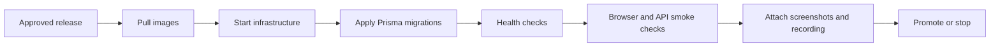

# CarbonLedger Deployment Runbooks

Operational procedures for the initial deployment, rolling update, rollback, and disaster recovery of the Docker Compose stack.

These runbooks apply to a Linux host with Docker Compose v2, access to the target environment's secrets, and a checked-out release revision. Use the staging environment first for every release. Do not run destructive recovery steps until the incident owner has approved them.

## Runbook Summary

| Scenario | Estimated time | Expected service interruption | Primary procedure |
| --- | ---: | --- | --- |
| Initial deployment | 30-45 minutes | Planned startup window | [Initial deployment](#initial-deployment) |
| Rolling update | 10-20 minutes | None when health gates pass | [Rolling update](#rolling-update) |
| Rollback | 5-15 minutes | None to brief degraded capacity | [Rollback](#rollback) |
| Disaster recovery | 45-120 minutes | Until restore and verification complete | [Disaster recovery](#disaster-recovery) |

Estimates exclude DNS propagation, contract deployment, backup transfer, and time spent waiting for an incident approval.

## Common Safety Rules

1. Record the release commit, image tags, operator, start time, and target environment in the deployment ticket.
2. Confirm the target is the intended host and environment before running any command.
3. Take or verify a database backup before an initial production deploy, migration, rollback, or recovery.
4. Never copy production secrets into staging. Staging uses separate databases and contract IDs.
5. Treat migrations as forward-only unless the migration owner has supplied and tested a compatible recovery plan. The rolling deployment requires additive migrations so old and new containers can run together.
6. Stop and escalate if a health check fails twice, a migration reports an error, or a contract ID differs from the approved environment record.

## Environment and Compose Files

Run commands from the repository root. The staging overlay uses a separate PostgreSQL database, Redis data volume, and contract configuration:

```bash
# Staging
COMPOSE="docker compose -f docker-compose.yml -f docker-compose.staging.yml"

# Production
COMPOSE="docker compose -f docker-compose.yml -f docker-compose.prod.yml"
```

Required staging values include `POSTGRES_PASSWORD`, `JWT_SECRET`, the `STAGING_*_CONTRACT_ID` values, and the oracle/admin key material described in [DEPLOYMENT_GUIDE.md](DEPLOYMENT_GUIDE.md). Production values must come from the production secret store.

Useful read-only checks:

```bash
git rev-parse --short HEAD
$COMPOSE ps
$COMPOSE logs --tail=100 backend
```

## Initial Deployment

**Estimated time:** 30-45 minutes  
**Use for:** a new host or an environment with no running CarbonLedger stack.

### 1. Prepare the host

Verify Docker Compose v2, available disk space, DNS, TLS certificates, and access to the target Stellar network. Create the deployment directory with the repository and the environment file supplied by the platform owner.

```bash
git clone https://github.com/Carbon-Ledger-stellar/carbonledger.git
cd carbonledger
git checkout <approved-release>

# Create or install the environment file using the approved secret-management process.
# Do not commit it.
cp .env.staging.example .env.staging  # staging only, when the example exists
```

For production, use the production environment file and production contract IDs. Do not use the staging overlay for production.

### 2. Validate configuration before startup

```bash
$COMPOSE config >/tmp/carbonledger-compose.rendered.yml
$COMPOSE config --services
```

Review the rendered configuration for the correct database name, network, API URLs, contract IDs, and image tags. Remove the rendered file if it contains secrets.

### 3. Create the stack

```bash
$COMPOSE pull
$COMPOSE up -d
```

Wait for the health checks to pass, then apply committed Prisma migrations:

```bash
$COMPOSE ps
$COMPOSE exec backend npx prisma migrate deploy
```

If migrations fail, do not restart repeatedly. Save the migration output, keep the database backup, and escalate to the release owner.

### 4. Verify every service

```bash
$COMPOSE ps
$COMPOSE logs --tail=100 backend frontend oracle_verification oracle_price oracle_satellite

# The base stack exposes the backend on localhost:3001.
curl --fail --silent --show-error http://localhost:3001/health
curl --fail --silent --show-error http://localhost:3001/health/ready
```

For staging, also verify the public endpoints configured in the environment:

```bash
curl --fail --silent --show-error https://staging-api.carbonledger.com/health
curl --fail --silent --show-error https://staging.carbonledger.com
```

Confirm that the response is from the intended release, the frontend can reach the backend, the database and Redis health checks are green, and all oracle services are connected to staging contract IDs.

### 5. Record the staging acceptance evidence

Before promoting the same release to production, attach all of the following to the deployment ticket:

- Screenshot of `$COMPOSE ps` showing all required services healthy.
- Screenshot of the backend `/health` response and the staging frontend loaded in a browser.
- Screenshot of the Grafana staging dashboard showing service health and no new error spike.
- A short screen recording of one read-only user journey: load the marketplace, open a listing, and confirm the API request succeeds.
- Release commit, image digests, operator, UTC timestamps, and the exact commands used.

The repository contains a visual deployment flow below. It is a procedure aid, not evidence that a particular staging release was executed.



## Rolling Update

**Estimated time:** 10-20 minutes  
**Use for:** an application release where the database migration is additive and compatible with both versions.

### 1. Preflight

```bash
export COMPOSE="docker compose -f docker-compose.yml -f docker-compose.prod.yml"
git fetch --tags origin
git checkout <approved-release>
git rev-parse --short HEAD
$COMPOSE ps
$COMPOSE exec backend npx prisma migrate status
```

Verify the previous image is available for rollback, the database backup is recent, and no incident is in progress. Announce the deployment window to operators.

### 2. Deploy with the repository script

`scripts/deploy.sh` pulls backend and frontend images, runs `prisma migrate deploy`, starts replacement replicas, waits for health, and runs a backend smoke check. It exits through its rollback handler if a command fails.

```bash
chmod +x scripts/deploy.sh
./scripts/deploy.sh
```

Do not interrupt the script while a replacement is starting unless the host is at risk. The production overlay is configured with `start-first`, one-at-a-time replacement, and a 15-second backend or 10-second frontend delay.

### 3. Verify after the update

```bash
$COMPOSE ps
curl --fail --silent --show-error https://api.carbonledger.com/health
curl --fail --silent --show-error https://carbonledger.com
$COMPOSE logs --since=10m backend frontend | grep -Ei 'error|fatal|exception' || true
docker stats --no-stream
```

Check error rate, latency, database pool usage, Redis connectivity, oracle freshness, and the Grafana alerts for at least 15 minutes. Close the deployment only after the new image digest and health evidence are recorded.

## Rollback

**Estimated time:** 5-15 minutes  
**Use for:** failed health checks, elevated error rates, incompatible behavior, or a release owner decision.

### 1. Declare and preserve evidence

Stop promotion, record the first failing timestamp, and save logs and container/image information before removing anything:

```bash
export COMPOSE="docker compose -f docker-compose.yml -f docker-compose.prod.yml"
$COMPOSE ps -a
$COMPOSE logs --since=30m backend frontend oracle_verification oracle_price oracle_satellite > rollback-logs-$(date -u +%Y%m%dT%H%M%SZ).txt
docker image ls --digests | tee rollback-images.txt
```

### 2. Restore the previous application image

Use the last known-good image digest from the deployment record. Pin `BACKEND_IMAGE` and `FRONTEND_IMAGE` in the environment used by the production overlay, then recreate only the application services:

```bash
export BACKEND_IMAGE=<previous-backend-image-or-digest>
export FRONTEND_IMAGE=<previous-frontend-image-or-digest>
$COMPOSE up -d --no-deps --force-recreate backend frontend
```

Wait for both services to become healthy before routing normal traffic. If the previous image is not available locally, pull it by its immutable digest first.

### 3. Handle migrations conservatively

Do not delete or edit rows to reverse an application rollback. If the failed release included a destructive or incompatible migration, stop and involve the database owner. Restore the database only under the [Disaster Recovery](#disaster-recovery) procedure after confirming the recovery point and data-loss window.

### 4. Verify and close

```bash
$COMPOSE ps
curl --fail --silent --show-error https://api.carbonledger.com/health
curl --fail --silent --show-error https://carbonledger.com
$COMPOSE logs --since=10m backend frontend
```

Monitor for 15 minutes, notify stakeholders, preserve the failed release artifacts, and open a follow-up incident with root cause and a re-deployment plan.

## Disaster Recovery

**Estimated time:** 45-120 minutes  
**Use for:** host loss, persistent database corruption, unrecoverable storage loss, or a regional outage.

Recovery targets must be set by the platform owner. Before an incident, document the approved **RPO** (maximum data loss) and **RTO** (maximum recovery time), backup location, DNS owner, secret-store owner, and the exact production contract IDs. Stellar contract state is not recreated from a database backup; use the public ledger and the approved contract IDs as the source of truth for on-chain state.

### 1. Declare the incident

1. Assign an incident commander and recovery operator.
2. Freeze deployments and write down the incident start time in UTC.
3. Confirm whether the original host is still writable. Do not start two writers against the same database.
4. Preserve logs, metrics, backup metadata, and the last successful deployment record.

### 2. Provision a clean recovery host

Install the approved OS, Docker Compose v2, TLS certificates, DNS access, and monitoring agent. Clone the exact last known-good release rather than `main`:

```bash
git clone https://github.com/Carbon-Ledger-stellar/carbonledger.git
cd carbonledger
git checkout <last-known-good-release>
```

Install the production environment from the secret store. Confirm database, Redis, Stellar RPC, frontend URL, and every contract ID before starting services.

### 3. Restore persistent data

Restore PostgreSQL to a new recovery database or volume using the backup provider's verified restore procedure. Validate backup checksum and timestamp first. Do not overwrite the source database until the recovery has been accepted.

Example for a plain SQL backup:

```bash
createdb -h <db-host> -U <db-admin> carbonledger_recovery
psql -v ON_ERROR_STOP=1 -h <db-host> -U <db-admin> \
  -d carbonledger_recovery < <verified-backup.sql
```

For managed PostgreSQL, use the provider's point-in-time restore and record the selected recovery timestamp. Restore Redis only if the application owner confirms that its cache or queue contents are required; otherwise start an empty Redis instance and allow caches to refill.

### 4. Start and verify the recovered stack

Point `DATABASE_URL` at the recovered database, then:

```bash
export COMPOSE="docker compose -f docker-compose.yml -f docker-compose.prod.yml"
$COMPOSE up -d
$COMPOSE ps
$COMPOSE exec backend npx prisma migrate deploy
curl --fail --silent --show-error http://localhost:3001/health
curl --fail --silent --show-error http://localhost:3001/health/ready
```

Verify database connectivity, read-only API requests, frontend-to-backend connectivity, oracle service startup, contract IDs, and Grafana ingestion. Reconcile a sample of recent off-chain records against the Stellar ledger before restoring write traffic.

### 5. Restore traffic and observe

1. Switch DNS or load-balancer traffic to the recovered host only after all health gates pass.
2. Keep the original host isolated until the incident commander approves decommissioning.
3. Monitor errors, latency, database connections, Redis, oracle freshness, disk, and logs for at least 30 minutes.
4. Record the actual RPO, RTO, restored backup, release, image digests, and any records that require reconciliation.
5. Schedule a recovery review and update this runbook with any changed commands or ownership details.

## Operator Sign-Off

Copy this checklist into the deployment or incident ticket:

```text
Environment:
Release commit:
Backend image digest:
Frontend image digest:
Operator:
Incident/deployment ticket:
Start time (UTC):
End time (UTC):
Database backup ID and timestamp:
Staging health evidence attached: [ ]
Staging screenshots attached: [ ]
Staging screen recording attached: [ ]
API and frontend checks passed: [ ]
Database migration status recorded: [ ]
Monitoring observation window completed: [ ]
Rollback or recovery plan confirmed: [ ]
Approved by:
```

## Related Documents

- [Zero-Downtime Deployment](deployment.md)
- [CarbonLedger Deployment Guide](DEPLOYMENT_GUIDE.md)
- [Deployment Checklist](../DEPLOYMENT_CHECKLIST.md)
- [Staging Compose Overlay](../docker-compose.staging.yml)
- [Production Compose Overlay](../docker-compose.prod.yml)
- [Deployment Script](../scripts/deploy.sh)
